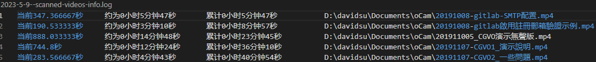

# 说明

统计指定文件夹中的所有视频的时长。

nodejs 环境运行: `node index.js`，

按照提示输入指定的扫描路径、视频格式，然后确认，等待扫描完成。

扫描过程会写入日志:

scanned-files-info.log : 扫描过的文件
scanned-ingore-info.log : 扫描过程忽略的文件（例如系统路径等）
scanned-videos-info.log : 扫描到的视频文件，可以看到扫描到的视频的时长，累计所有视频的时长。

忽略的文件夹关键字在`ingoreDirKeywords`变量，扫描的视频格式在`defaultVideoFormats`变量。

截图:

